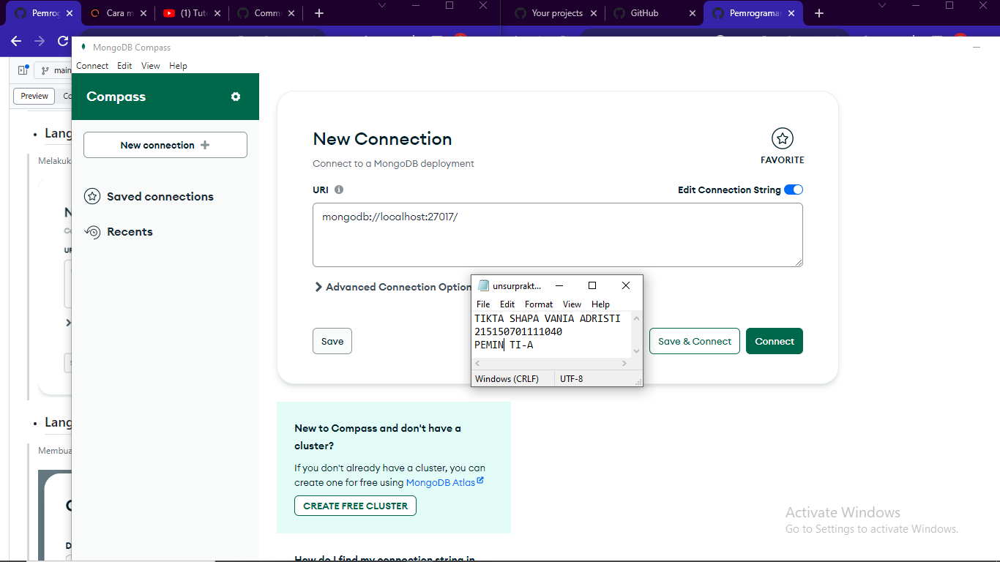
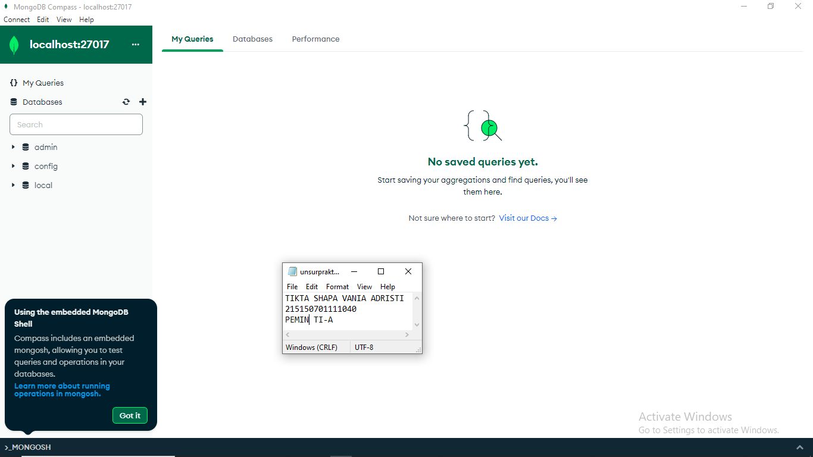

# Praktikum 2 : CRUD MongoDB Compass dan Shell

Langkah - langkah dan hasil Screenshot praktikum CRUD MongoDB Compass dan Shell.
## MongoDB Compass
* ## Langkah 1 
> Melakukan koneksi ke MongoDB menggunakan connection string   

* ## Langkah 2 
> Membuat database dengan melakukan klik “Create Database”   

* ## Langkah 3 
> Melakuakan insert buku pertama dengan melakukan klik “Add Data”, pilih “Insert
Document”, isi dengan data yang diinginkan dan klik “Insert”

* ## Langkah 4 
> insert buku kedua dengan cara yang sama.

* ## Langkah 5
> Melakukan pencarian buku dengan author “Osamu Dazai” dengan mengisi filter yang
diinginkan dan klik “Find”

* ## Langkah 6
> Melakukan perubahan summary pada buku “No Longer Human” menjadi “Buku yang
bagus (<NAMA>,<NIM>) dengan melakukan klik “Edit Document” (berlambang
pensil), mengisi nilai summary yang baru, dan melakukan klik “Update”

* ## Langkah 7
> Melakukan penghapusan pada buku “I Am a Cat” dengan melakukan klik “Remove
Document” (berlambang tong sampah) dan melakukan klik “Delete”

## MongoDB Shell
* ## Langkah 1
> Melakukan koneksi ke MongoDB Server dengan menjalankan command mongosh bagi
yang menggunakan terminal build in OS sehingga tampilan terminal kalian akan
menjadi seperti berikut

* ## Langkah 2
> Melihat list database yang ada di server dengan menjalankan command
show dbs
> Untuk berpindah ke database “bookstore” gunakan command use bookstore , kalian
dapat memastikan telah berpindah ke database yang benar dengan melihat tulisan
sebelum tanda “>”
> Melihat collection yang ada pada database tersebut dengan
menggunakan command show collections

* ## Langkah 3
> Melakukan insert buku “Overlord I” dengan menggunakan command
db.books.insertOne(<data kalian>) , setelah insert buku berhasil maka MongoDB akan
mengembalikan pesan sebagai berikut.

* ## Langkah 4
> Melakukan insert buku “The Setting Sun” dan “Hujan” dengan insert many dengan
menggunakan command db.books.insertMany(<data kalian>) , dan akan mengembalikan pesan sebagai berikut.

* ## Langkah 5
> Melakukan pencarian buku dengan menggunakan command db.books.find() untuk
melakukan pencarian semua buku.

* ## Langkah 6
> Menampilkan seluruh buku dengan author “Osamu Dazai” dengan mengisi argument
pada find() dengan menggunakan command db.books.find({<filter yang ingin
diisi>})

* ## Langkah 7
> Melakukan perubahan summary pada buku “Hujan” menjadi “Buku yang bagus
(<NAMA>,<NIM>) dengan mengunakan command db.books.updateOne({<filter>},
{$set: {<data yang akan di update>}}) sehingga output yang dihasilkan oleh MongoDB
akan menjadi seperti berikut

* ## Langkah 8
> Melakukan perubahan publisher menjadi “Yen Press” pada semua buku “Osamu
Dazai” dengan menggunakan command db.books.updateMany({<filter>}, {$set: {<data
yang akan di update>}})

* ## Langkah 9
> Melakukan penghapusan pada buku “Overlord I” dengan menggunakan command
db.books.deleteOne({<argument>})

* ## Langkah 9
> Melakukan penghapusan pada semua buku “Osamu Dazai dengan menggunakan
command db.books.deleteMany({<argument>})

