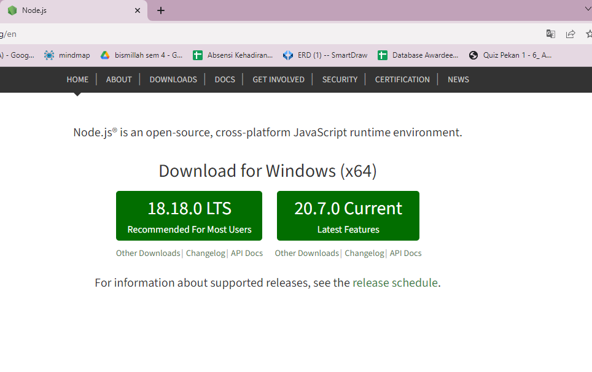
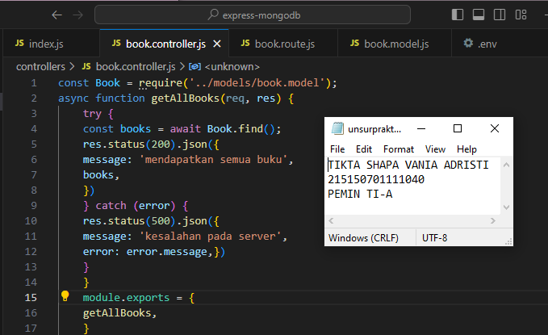

# Praktikum 3 : Integrasi MongoDB dan Express

Langkah - langkah dan hasil Screenshot praktikum CRUD MongoDB Compass dan Shell.
## Percobaan instalasi NodeJS
* ## Langkah 1 
>  Buka halaman https://nodejs.org/en/   

* ## Langkah 2 
> Download dan jalankan node setup   

* ## Langkah 3 
> Setelah instalasi selesai jalankan command node -v untuk memeriksa apakah
NodeJS sudah terinstall

## Inisiasi project Express dan pemasangan package
* ## Langkah 1
>  Lakukan pembuatan folder dengan nama express-mongodb dan masuk ke dalam
folder tersebut lalu buka melalui text editor masing-masing

* ## Langkah 2
> Lakukan npm init untuk mengenerate file package.json dengan menggunakan
command npm init -y

* ## Langkah 3
> Lakukan instalasi express, mongoose, dan dotenv dengan menggunakan command
npm i express mongoose dotenv
 

## Koneksi Express ke MongoDB
* ## Langkah 1 
>  Buatlah file index.js pada root folder dan masukkan kode di bawah ini   
  require('dotenv').config();  
 const express = require('express'); 
 const mongoose = require('mongoose'); 
 const app = express(); 
 app.use(express.json()); 
 app.get('/', (req, res) => { 
 res.status(200).json({ 
 message: '<nama>,<nim>' 
 }) 
 }) 
 const PORT = 8000; 
 app.listen(PORT, () => { 
 console.log(`Running on port ${PORT}`); 
 }) 
>   Setelah itu coba jalankan aplikasi dengan command node index.js  

* ## Langkah 2 
>  Lakukan pembuatan file .env dan masukkan baris berikut   

* ## Langkah 3 
> Setelah instalasi selesai jalankan command node -v untuk memeriksa apakah
NodeJS sudah terinstall
> Setelah itu ubahlah kode pada listening port menjadi berikut dan coba jalankan aplikasi kembali
>   const PORT = process.env.PORT || 8000;  
  app.listen(PORT, () => {  
  console.log(`Running on port ${PORT}`);  
  })  
  MONGO_URI=<Connection string masing-masing>  

* ## Langkah 4
> Tambahkan baris kode berikut pada file index.js
>   require('dotenv').config();   
  const express = require('express');   
  const mongoose = require('mongoose');   
  mongoose.connect(process.env.MONGO_URI);   
  const db = mongoose.connection;   
  db.on('error', (error) => {   
  console.log(error);  
  });  
  db.once('connected', () => {   
  console.log('Mongo connected');   
  })  

## Pembuatan routing
* ## Langkah 1 
>  Lakukan pembuatan direktori routes di tingkat yang sama dengan index.js   

* ## Langkah 2 
>   Buatlah file book.route.js di dalamnya   

* ## Langkah 3 
> Tambahkan baris kode berikut untuk fungsi getAllBooks
 const router = require('express').Router();  
 router.get('/', function getAllBooks(req, res) {  
 res.status(200).json({  
 message: 'mendapatkan semua buku'  
 })  
 })  
 module.exports = router;  

* ## Langkah 4
> Lakukan hal yang sama untuk getOneBook, createBook, updateBook, dan
deleteBook
>   const router = require('express').Router();   
  ...  
  router.get('/:id', function getOneBook(req, res) {  
  const id = req.params.id;  
  res.status(200).json({  
  message: 'mendapatkan satu buku',  
  id,  
  })  
  })  
  router.post('/', function createBook(req, res)  
   res.status(200).json({  
  message: 'membuat buku baru'  
  })  
  })  
  router.put('/:id', function updateBook(req, res) {  
  const id = req.params.id;  
  res.status(200).json({  
  message: 'memperbaharui satu buku',  
  id,  
  })  
  })  
  router.delete('/:id', function deleteBook(req, res) {  
  const id = req.params.id;  
  res.status(200).json({  
  message: 'menghapus satu buku',  
  id,  
  })  
  })  
  module.exports = router {  

* ## Langkah 5
> Lakukan import book.route.js pada file index.js dan tambahkan baris kode berikut
 require('dotenv').config();  
 const express = require('express');  
 const mongoose = require('mongoose');  
 const bookRoutes = require('./routes/book.route'); //  
 ...  
 app.get('/', (req, res) => {  
 res.status(200).json({  
 message: ','  
 })  
 })  
 app.use('/books', bookRoutes); //  
 const PORT = process.env.PORT || 8000;  
 app.listen(PORT, () => {  
 console.log(Running on port ${PORT});  
 })  

* ## Langkah 6
>  Uji salah satu endpoint dengan Postman

## Pembuatan controller
* ## Langkah 1 
> Lakukan pembuatan direktori controllers di tingkat yang sama dengan index.js   

* ## Langkah 2 
>  Buatlah file book.controller.js di dalamnya   

* ## Langkah 3 
>  Salin baris kode dari routes untuk fungsi getAllBooks
 cfunction getAllBooks(req, res) {  
 res.status(200).json({  
 message: 'mendapatkan semua buku'   
 })  
 };  
 module.exports = {  
 getAllBooks,   
 }   

* ## Langkah 4
>  Lakukan hal yang sama untuk getOneBook, createBook, updateBook, dan
deleteBook
>   function getOneBook(req, res) {  
   const id = req.params.id; 
   res.status(200).json({ 
   message: 'mendapatkan satu buku', 
   id, 
   }) 
   } 
   function createBook(req, res) { 
   res.status(200).json({ 
   message: 'membuat buku baru' 
   }) 
   } 
   function updateBook(req, res) { 
   const id = req.params.id; 
   res.status(200).json({ 
   message: 'memperbaharui satu buku', 
   id, 
   }) 
   } 
   function deleteBook(req, res) { 
   const id = req.params.id; 
   res.status(200).json({ 
   message: 'menghapus satu buku', 
   id, 
   }) 
   } 
   module.exports = { 
   getAllBooks, 
   getOneBook, // 
   createBook, // 
   updateBook, // 
   deleteBook // 
   } 
   

* ## Langkah 5
> Lakukan import book.controller.js pada file book.route.js
 const router = require('express').Router(); 
 const book = require('../controllers/book.controller');; 
 module.exports = router; 

* ## Langkah 6
>   Lakukan perubahan pada fungsi agar dapat memanggil fungsi dari book.controller.js
>   const router = require('express').Router();          
 const book = require('../controllers/book.controller');     
 router.get('/', book.getAllBooks);           
  router.get('/:id', book.getOneBook);          
 router.post('/', book.createBook);           
  router.put('/:id', book.updateBook);          
 router.delete('/:id', book.deleteBook);           
  module.exports = router;  

## Pembuatan model
* ## Langkah 1 
>Lakukan pembuatan direktori models di tingkat yang sama dengan index.js  

* ## Langkah 2 
> Buatlah file book.model.js di dalamnya  

* ## Langkah 3 
> Tambahkan baris kode berikut sesuai dengan tabel di atas
 const mongoose = require('mongoose'); 
 const bookSchema = new mongoose.Schema({ 
 title: { 
 type: String 
 }, 
 author: { 
 type: String 
 }, 
 year: { 
 type: Number 
 }, 
 pages: { 
 type: Number 
 }, 
 summary: { 
 type: String 
 }, 
 publisher: { 
 type: String 
 } 
 }) 
 module.exports = mongoose.model('book', bookSchema);  

## Operasi CRUD
* ## Langkah 1 
> Hapus semua data pada collection books   

* ## Langkah 2 
>  Hapus semua data pada collection books  
 const Book = require('../models/book.model'); 

* ## Langkah 3 
>  Lakukan perubahan pada fungsi createBook
 const Book = require('../models/book.model'); 
 ... 
 async function createBook(req, res) { 
 const book = new Book({ 
 title: req.body.title, 
 author: req.body.author, 
 year: req.body.year, 
 pages: req.body.pages, 
 summary: req.body.summary, 
 publisher: req.body.publisher, 
 }) 
 try { 
 const savedBook = await book.save(); 
 res.status(200).json({ 
 message: 'membuat buku baru', 
 book: savedBook, 
 }) 
 } catch (error) { 
 res.status(500).json({ 
 message: 'kesalahan pada server', 
 error: error.message, 
 }) 
 } 
 } 

* ## Langkah 4
>   Buatlah dua buah buku dengan data di bawah ini dengan Postman
>   { 
  "title": "Dilan 1990", 
  "author": "Pidi Baiq", 
  "year": 2014, 
  "pages": 332, 
  "summary": "Mirea, anata wa utsukushī", 
  "publisher": "Pastel Books" 
 } 
  { 
 "title": "Dilan 1991", 
 "author": "Pidi Baiq", 
 "year": 2015, 
 "pages": 344, 
 "summary": "Watashi ga kare o aishite iru to ittara", 
 "publisher": "Pastel Books" 
 } 

* ## Langkah 5
>  Lakukan perubahan pada fungsi getAllBooks
 const Book = require('../models/book.model');  
 async function getAllBooks(req, res) { 
 try { 
 const books = await Book.find(); 
 res.status(200).json({ 
 message: 'mendapatkan semua buku', 
 books, 
 }) 
 } catch (error) { 
 res.status(500).json({ 
 message: 'kesalahan pada server', 
 error: error.message, 
 }) 
 } 
 } 

* ## Langkah 6
> Lakukan perubahan pada fungsi getOneBook
>   const Book = require('../models/book.model');  
 async function getOneBook(req, res) { 
  const id = req.params.id; 
  try { 
  const book = await Book.findById(id); 
  res.status(200).json({ 
  message: 'mendapatkan satu buku', 
  book, 
  }) 
  } catch (error) { 
  res.status(500).json({ 
  message: 'kesalahan pada server', 
  error: error.message, 
  }) 
  } 
  }  

* ## Langkah 7
> Tampilkan semua buku dengan Postman

* ## Langkah 8
>  Tampilkan buku Dilan 1990 dengan Postman

* ## Langkah 9
> Lakukan perubahan pada fungsi updateBook
 const Book = require('../models/book.model'); 
 ... 
 async function updateBook(req, res) { 
 const id = req.params.id; 
 try { 
 const book = await Book.findByIdAndUpdate( 
 id, req.body, { new: true } 
 ) 
 res.status(200).json({ 
 message: 'memperbaharui satu buku', 
 book, 
 }) 
 } catch (error) { 
 res.status(500).json({ 
 message: 'kesalahan pada server', 
 error: error.message, 
 }) 
 } 
 } 

* ## Langkah 10
> Ubah judul buku Dilan 1991 menjadi "NAMA PANGGILAN" 1991" disini milik saya menjadi Tikta 1991 dengan Postman

* ## Langkah 11
> Lakukan perubahan pada fungsi deleteBook
 const Book = require('../models/book.model'); 
 async function deleteBook(req, res) { 
 const id = req.params.id; 
 try { 
 const book = await Book.findByIdAndDelete(id); 
 res.status(200).json({ 
 message: 'menghapus satu buku', 
 book, 
 }) 
 } catch (error) { 
 res.status(500).json({ 
 message: 'kesalahan pada server', 
 error: error.message, 
 }) 
 } 
 } 

* ## Langkah 12
> Hapus buku Dilan 1990 dengan Postman

