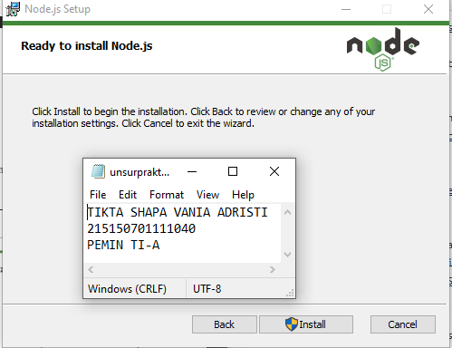

# Praktikum 3 : Integrasi MongoDB dan Express

Langkah - langkah dan hasil Screenshot praktikum CRUD MongoDB Compass dan Shell.
## Percobaan instalasi NodeJS
* ## Langkah 1 
>  Buka halaman https://nodejs.org/en/   

* ## Langkah 2 
> Download dan jalankan node setup   

* ## Langkah 3 
> Setelah instalasi selesai jalankan command node -v untuk memeriksa apakah
NodeJS sudah terinstall

## Inisiasi project Express dan pemasangan package
* ## Langkah 1
>  Lakukan pembuatan folder dengan nama express-mongodb dan masuk ke dalam
folder tersebut lalu buka melalui text editor masing-masing

* ## Langkah 2
> Lakukan npm init untuk mengenerate file package.json dengan menggunakan
command npm init -y

* ## Langkah 3
> Lakukan instalasi express, mongoose, dan dotenv dengan menggunakan command
npm i express mongoose dotenv
 

## Koneksi Express ke MongoDB
* ## Langkah 1 
>  Buatlah file index.js pada root folder dan masukkan kode di bawah ini   
  require('dotenv').config();  
 const express = require('express'); 
 const mongoose = require('mongoose'); 
 const app = express(); 
 app.use(express.json()); 
 app.get('/', (req, res) => { 
 res.status(200).json({ 
 message: '<nama>,<nim>' 
 }) 
 }) 
 const PORT = 8000; 
 app.listen(PORT, () => { 
 console.log(`Running on port ${PORT}`); 
 }) 
>   Setelah itu coba jalankan aplikasi dengan command node index.js  

* ## Langkah 2 
>  Lakukan pembuatan file .env dan masukkan baris berikut   

* ## Langkah 3 
> Setelah instalasi selesai jalankan command node -v untuk memeriksa apakah
NodeJS sudah terinstall
> Setelah itu ubahlah kode pada listening port menjadi berikut dan coba jalankan aplikasi kembali
>   const PORT = process.env.PORT || 8000;  
  app.listen(PORT, () => {  
  console.log(`Running on port ${PORT}`);  
  })  
  MONGO_URI=<Connection string masing-masing>  

* ## Langkah 4
> Tambahkan baris kode berikut pada file index.js
>   require('dotenv').config();   
  const express = require('express');   
  const mongoose = require('mongoose');   
  mongoose.connect(process.env.MONGO_URI);   
  const db = mongoose.connection;   
  db.on('error', (error) => {   
  console.log(error);  
  });  
  db.once('connected', () => {   
  console.log('Mongo connected');   
  })  

* ## Langkah 5
> Melakukan pencarian buku dengan menggunakan command db.books.find() untuk
melakukan pencarian semua buku.

* ## Langkah 6
> Menampilkan seluruh buku dengan author “Osamu Dazai” dengan mengisi argument
pada find() dengan menggunakan command db.books.find({<filter yang ingin
diisi>})

* ## Langkah 7
> Melakukan perubahan summary pada buku “Hujan” menjadi “Buku yang bagus
(<NAMA>,<NIM>) dengan mengunakan command db.books.updateOne({<filter>},
{$set: {<data yang akan di update>}}) sehingga output yang dihasilkan oleh MongoDB
akan menjadi seperti berikut

* ## Langkah 8
> Melakukan perubahan publisher menjadi “Yen Press” pada semua buku “Osamu
Dazai” dengan menggunakan command db.books.updateMany({<filter>}, {$set: {<data
yang akan di update>}})

* ## Langkah 9
> Melakukan penghapusan pada buku “Overlord I” dengan menggunakan command
db.books.deleteOne({<argument>})

* ## Langkah 10
> Melakukan penghapusan pada semua buku “Osamu Dazai dengan menggunakan
command db.books.deleteMany({<argument>})

