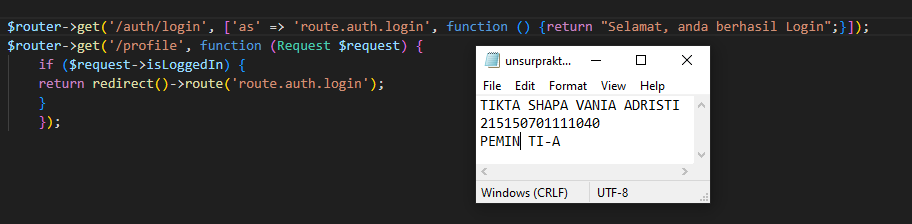
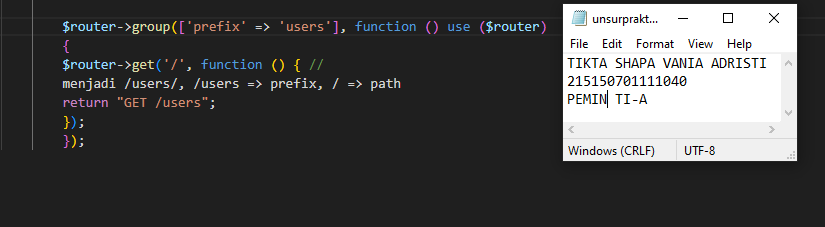
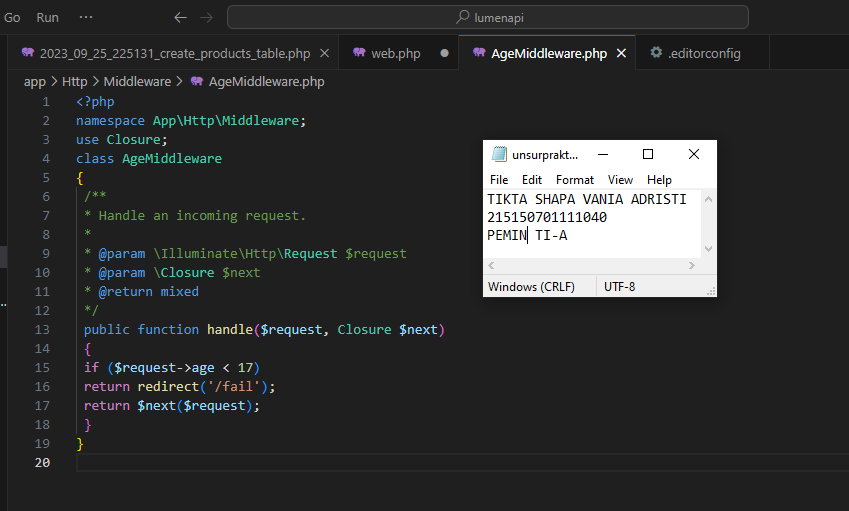

# Praktikum  5 : Dynamic Route dan Middleware

Langkah-langkah dan hasil Screenshot praktikum 5 – Dynamic Route dan Middleware.
## Dynamic Route
* ## Langkah 1 
>  Untuk menambahkan dynamic routes pada aplikasi lumen kita, kita dapat menggunakan syntax berikut,
  $router->get('/user/{id}', function ($id) {  
   return 'User Id = ' . $id;  
  });  
$router->get('/post/{postId}/comments/{commentId}', function ($postId, $commentId) {
return 'Post ID = ' . $postId . ' Comments ID = ' . $commentId;
});
> $router->get('/users[/{userId}]', function ($userId = null) {
return $userId === null ? 'Data semua users' : 'Data user dengan id ' . $userId;
});

* ## Langkah 2 
> Aliases Route digunakan untuk memberi nama pada route yang telah kita buat, hal ini dapat membantu kita, saat kita ingin memanggil route tersebut pada aplikasi kita. Berikut syntax
untuk menambahkan aliases route
   
 $router->get('/auth/login', ['as' => 'route.auth.login', function (...) {...}])
...
$router->get('/profile', function (Request $request) {
if ($request->isLoggedIn) {
return redirect()->route('route.auth.login');
}
});

* ## Langkah 3 
> Setelah aplikasi berhasil dijalankan, kita dapat membuka browser dengan url,
http://localhost:8000/get, path yang akan kita akses akan berbentuk demikian,
http://{BASE_URL}{PATH}, jika BASE_URL kita adalah localhost:8000 dan PATH kita
adalah /get, maka url akan berbentuk seperti diatas.

## POST, PUT, PATCH, DELETE, dan OPTIONS
* ## Langkah 1
>  Sama halnya saat menambahkan method GET, kita dapat menambahkan methode POST, PUT, PATCH, DELETE, dan OPTIONS pada file web.php dengan code seperti ini
>   $router->post('/post', function () {  
  return 'POST';  
  });  
  $router->put('/put', function () {  
  return 'PUT';  
  });  
  $router->patch('/patch', function () {
 return 'PATCH';  
  });  
  $router->delete('/delete', function () {
 return 'DELETE';  
  });  
  $router->options('/options', function () {
 return 'OPTIONS';  
  });  

* ## Langkah 2
> Mengakses url http://localhost:8000/get pada Postman

* ## Langkah 3
> Mengakses url http://localhost:8000/post pada Postman
 

* ## Langkah 4
> Mengakses url http://localhost:8000/put pada Postman
 

* ## Langkah 5
> Mengakses url http://localhost:8000/patch pada Postman
 

* ## Langkah 6
> Mengakses url http://localhost:8000/delete pada Postman
 

* ## Langkah 7
> Mengakses url http://localhost:8000/options pada Postman
 

## Migrasi Database
* ## Langkah 1 
>  Sebelum melakukan migrasi database pastikan server database aktif kemudian pastikan sudah membuat database dengan nama lumenapi 

* ## Langkah 2 
>  Kemudian ubah konfigurasi database pada file .env menjadi seperti ini   DB_CONNECTION=mysql  
  DB_HOST=127.0.0.1  
  DB_PORT=3306  
  DB_DATABASE=lumenapi  
  DB_USERNAME=root  
  DB_PASSWORD=<<password masing-masing>>  
   

* ## Langkah 3 
>Setelah mengubah konfigurasi pada file .env, kita juga perlu menghidupkan beberapa library bawaan dari lumen dengan membuka file app.php pada folder bootstrap dan mengubah baris ini,
>  //$app->withFacades(); 
 //$app->withEloquent();  
  Menjadi  
  $app->withFacades();
$app->withEloquent();  

* ## Langkah 4
> Setelah itu jalankan command berikut untuk membuat file migration
>   php artisan make:migration create_users_table # membuat migrasi
untuk tabel users 
 php artisan make:migration create_products_table # membuat
migrasi untuk tabel products 
  Setelah menjalankan 2 syntax diatas akan terbuat 2 file pada folder database/migrations dengan format YYYY_MM_DD_HHmmss_nama_migrasi. Pada file migrasi kita akan menemukan fungsi up() dan fungsi down(), fungsi up() akan digunakan pada saat kita melakukan migrasi, fungsi down() akan digunakan saat kita ingin me-rollback migrasi  

* ## Langkah 5
> Ubah fungsi up pada file migrasi create_users_table menjadi seperti dibawah ini
 public function up() 
 { 
 Schema::create('users', function (Blueprint $table) { 
 $table->id(); 
 $table->timestamps(); 
 $table->string('email'); 
 $table->string('password'); 
 }); 
 } 

* ## Langkah 6
> Ubah fungsi up pada file migrasi create_products_table menjadi seperti dibawah ini
 public function up() 
 { 
 Schema::create('products', function (Blueprint $table) { 
 $table->id(); 
 $table->timestamps(); 
 $table->string('name'); 
 $table->integer('category_id'); 
 $table->string('slug'); 
 $table->integer('price'); 
 $table->integer('weight'); 
 a$table->text('description'); 
 }); 
 } 

* ## Langkah 6
>  Kemudian jalankan command,
  php artisan migrate

* ## Langkah 7
> Tampilan tabel yang berhasil dibuat pada database lumenapi di phpmyadmin

