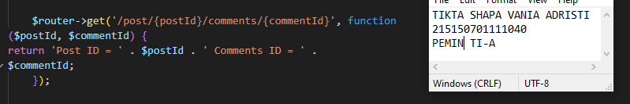
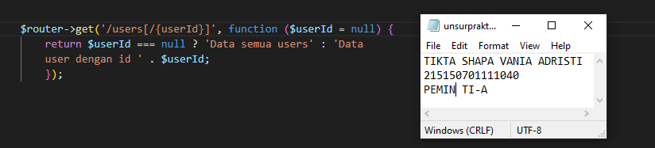

# Praktikum  5 : Dynamic Route dan Middleware

Langkah-langkah dan hasil Screenshot praktikum 5 – Dynamic Route dan Middleware.
## Dynamic Route
* ## Langkah 1 
Dynamic route adalah route yang dapat berubah-ubah, contohnya pada saat kita membuka
suatu halaman web, kadang kita melihat /users/1 atau /users/2 , hal ini yang dinamakan
dynamic routes.
 Untuk menambahkan dynamic routes pada aplikasi lumen kita, kita dapat menggunakan
syntax berikut,
 $router->get('/user/{id}', function ($id) {
 return 'User Id = ' . $id;
 });
 Saat menambahkan parameter pada routes, kita tidak terbatas pada 1 variable saja, namun
kita dapat menambahkan sebanyak yang diperlukan seperti kode berikut,
 $router->get('/post/{postId}/comments/{commentId}', function ($postId, $commentId) {
 return 'Post ID = ' . $postId . ' Comments ID = ' . $commentId;
 });
 Pada dynamic routes kita juga bisa menambahkan optional routes, yang mana optional
routes tidak mengharuskan kita untuk memberi variable pada endpoint kita, namun saat kita
memanggil endpoint, dapat menggunakan parameter variable ataupun tidak, seperti pada
kode dibawah ini
 $router->get('/users[/{userId}]', function ($userId = null) {
 return $userId === null ? 'Data semua users' : 'Data user dengan id ' . $userId;
 });
 

* ## Langkah 2 Aliases Route
Aliases Route digunakan untuk memberi nama pada route yang telah kita buat, hal ini dapat
membantu kita, saat kita ingin memanggil route tersebut pada aplikasi kita. Berikut syntax
untuk menambahkan aliases route  
$router->get('/auth/login', ['as' => 'route.auth.login', function (...) {...}])
 ...
 $router->get('/profile', function (Request $request) {
 if ($request->isLoggedIn) {
 return redirect()->route('route.auth.login');
 }
 });

 Mengakses endpoint /profile pada Postman.
 Karena pada langkah sebelumnya telah diatur menjadi false, maka routes tidak mengembalikan nilai apa-apa.

 Menambahkan syntax aliases route pada file web.php dan mengubah kondisinya menjadi true.

 Mengakses endpoint /profile pada Postman. Karena pada langkah sebelumnya telah diatur menjadi true, maka routes akan memanggil route.auth.login dan menampilkan pesan seperti pada gambar.

* ## Langkah 3 Group Route
Pada lumen, kita juga dapat memberikan grouping pada routes kita agar lebih mudah pada
saat penulisan route pada web.php kita. Kita dapat melakukan grouping dengan
menggunakan syntax berikut,
 $router->group(['prefix' => 'users'], function () use ($router) {
 $router->get('/', function () { // menjadi /users/, /users => prefix, / => path
 return "GET /users";
 });
 });

* ## Langkah 4 Middleware
Middleware adalah penengah antara komunikasi aplikasi dan client. Middleware biasanya digunakan untuk membatasi siapa yang dapat berinteraksi dengan aplikasi kita dan semacamnya, kita dapat menambahkan middleware dengan menambahkan file pada folder app/Http/Middleware . Pada folder tersebut terdapat file ExampleMiddleware , kita dapat men-copy file tersebut untuk membuat middleware baru.
Kemudian, setelah menambahkan filter pada AgeMiddleware , kita harus mendaftarkan
AgeMiddleware pada aplikasi kita, pada file bootstrap/app.php
Lalu, kita dapat menambahkan middleware pada routes kita dengan menambahkan opsi
middleware pada salah satu route

