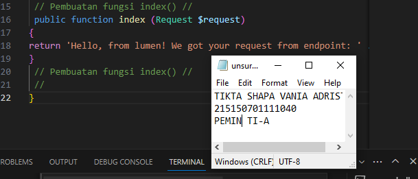

# Modul 6 Pemrograman Integratif TI-A
  
## Model
### Langkah 1
Pastikan terdapat tabel users yang dibuat menggunakan migration pada bab sebelumnya. <br /><br />
 <br /><br />

### Langkah 2
Mengganti baris kode pada file app/Models/User.php seperti berikut. <br /><br />
<?php
namespace App\Models;
use Illuminate\Database\Eloquent\Model;
cla User extends Model
{
/**
* The attributes that are ma aignable.
*
* @var array
/
protected $fillable = [ 'name', 'email', 'paword'];
/**
The attributes excluded from the model's JSON form.
*
* @var array
*/
protected $hidden = [];
}
 <br /><br />

## Controller
### Langkah 1
Copy file "ExampleController.php", ubah nama file menjadi "HomeController.php", kemudian masukkan baris kode berikut. <br /><br />
 <br /><br />

### Langkah 2
Ubah route `/` pada file routes/web.php menjadi seperti berikut. <br /><br />
 <br /><br />

### Langkah 3
Buka browser dan akses path ```http://localhost:8000``` <br /><br />
 <br /><br />

## Request Handler
### Langkah 1
Import library Request pada file app/Http/Controllers/HomeController.php <br /><br />
 <br /><br />

### Langkah 2
Ubah baris kode pada fungsi index seperti berikut. <br /><br />
 <br /><br />

### Langkah 3
Buka browser dan akses path ```http://localhost:8000``` <br /><br />
 <br /><br />

## Response Handler
### Langkah 1
Import library Response pada file app/Http/Controllers/HomeController.php <br /><br />
 <br /><br />

### Langkah 2
Buat fungsi hello() dan menambahkan baris kode seperti berikut. <br /><br />
 <br /><br />

### Langkah 3
Tambahkan route /hello pada file routes/web.php <br /><br />
 <br /><br />

### Langkah 4
Buka browser dan akses path ```http://localhost:8000/hello``` <br /><br />
 <br /><br />

## Penerapan
### Langkah 1
Import library model User pada file app/Http/Controllers/HomeController.php <br /><br />
 <br /><br />

### Langkah 2
Tambahkan route middleware dengan baris kode berikut. <br /><br />
 <br /><br />


### Langkah 3
Tambahkan fungsi defaultUser(), createUser(), dan getUser() dengan baris kode berikut pada file routes/web.php <br /><br />
 <br /><br />

### Langkah 4
Jalankan aplikasi pada postman sesuai endpoint. <br /><br />
A. POST users/default <br /><br />
 <br /><br />
B. POST users/new <br /><br />
 <br /><br />
C. GET users/all <br /><br />
 <br /><br />
