# Praktikum  8 : Register, Authentication dan Authorization

Langkah-langkah dan hasil Screenshot praktikum  8 : Register, Authentication dan Authorization
* ## Register
* ### Langkah 1
Pastikan terdapat tabel users yang dibuat menggunakan migration pada bab 3 Basic Routing dan Migration, 
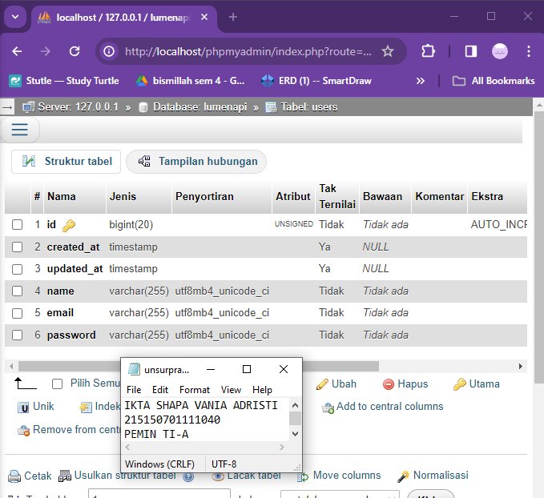
* ### Langkah 2
Pastikan terdapat model User.php yang digunakan pada bab 5 Model, Controller dan Request-Response Handler.
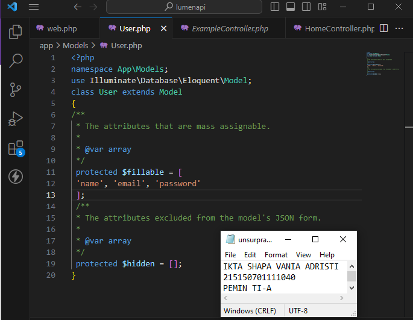
* ### Langkah 3
Membuat file AuthController.php
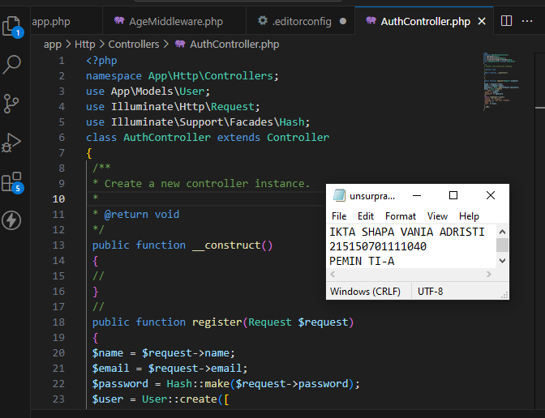
* ### Langkah 4
Menambahkan baris berikut pada routes/web.php
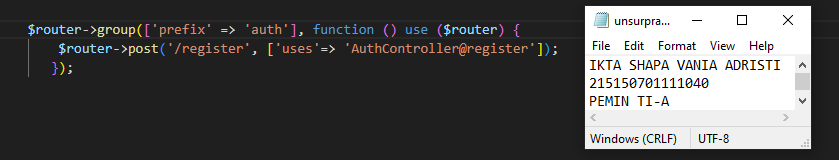
* ### Langkah 5
Menjalankan aplikasi pada endpoint /auth/register
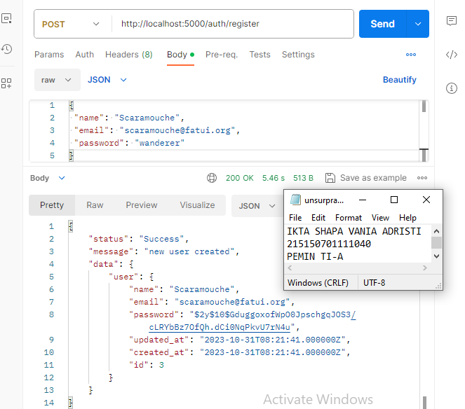

* ## Authentication
* ### Langkah 1
Membuatfungsi login(Request $request) pada file AuthController.php
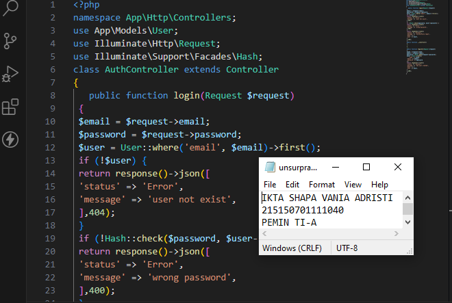
* ### Langkah 2
Menambahkan baris berikut pada routes/web.php
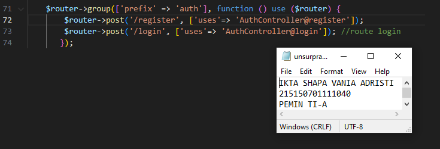
* ### Langkah 3
Menjalankan aplikasi pada endpoint /auth/login
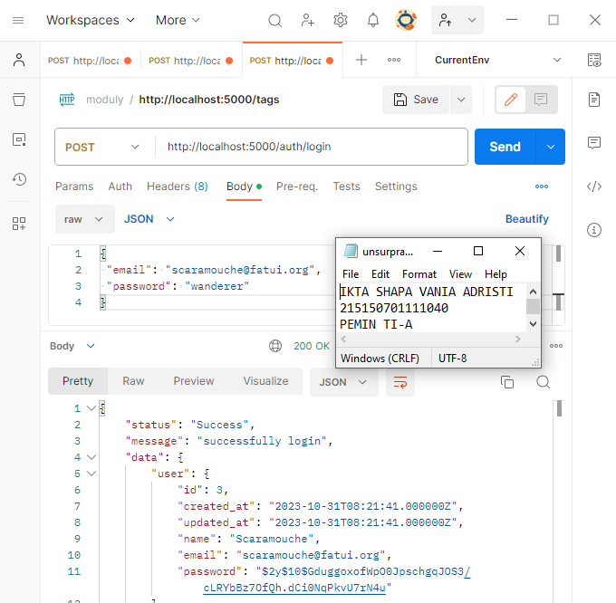

* ## Token
* ### Langkah 1
Membuat migrasi baru
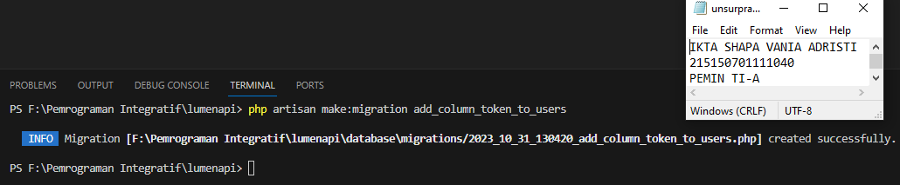
* ### Langkah 2
Menambahkan baris berikut pada migration yang baru terbuat
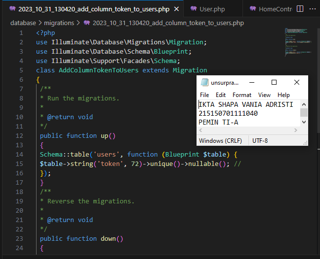
* ### Langkah 3
Menambahkan atribut token di $fillable pada User.php
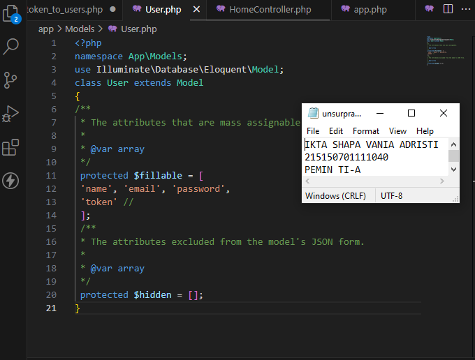
* ### Langkah 4
Menambahkan baris berikut pada file AuthController.php
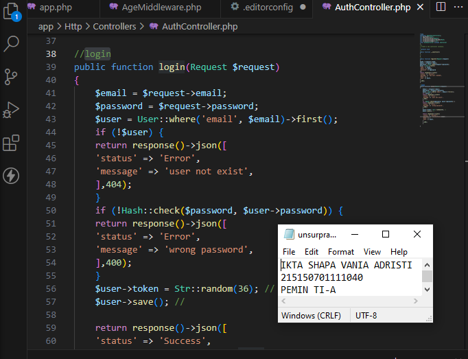
* ### Langkah 5
Menjalankan migrasi terbaru
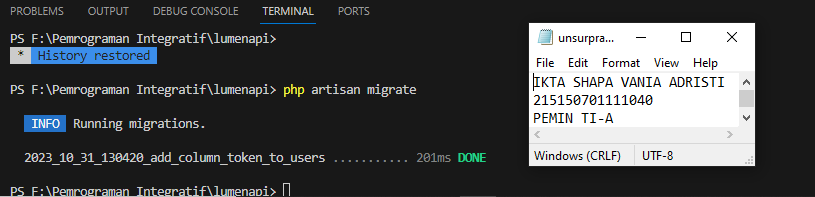
* ### Langkah 6
Menjalankan aplikasi pada endpoint /auth/login
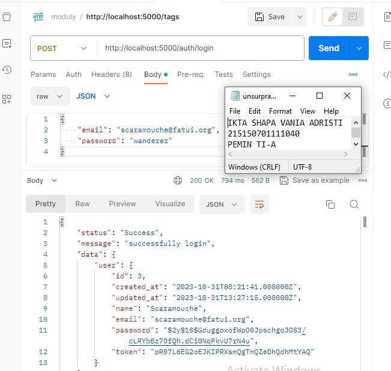

* ## Authorization
* ### Langkah 1
Membuat file Authorization.php pada folder App/Http/Middleware

* ### Langkah 2
Menambahkan middleware yang baru dibuat pada bootstrap/app.php.
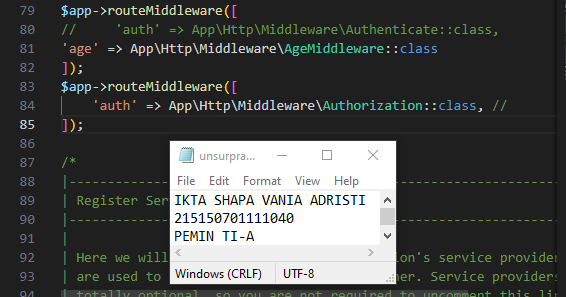
* ### Langkah 3
Membuat fungsi home() pada HomeController.php
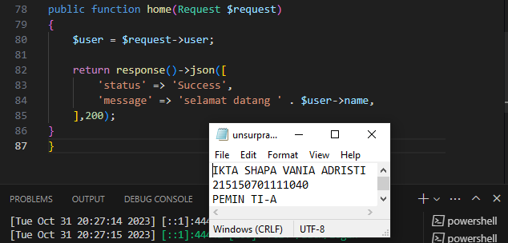
* ### Langkah 4
Menambahkan baris berikut pada routes/web.php

* ### Langkah 5
Menjalankan aplikasi pada endpoint /home dengan melampirkan nilai token yang didapat setelah login
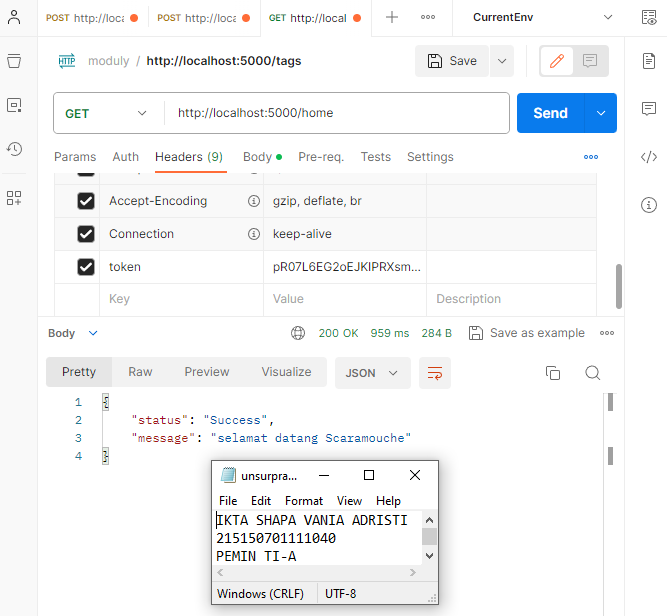
